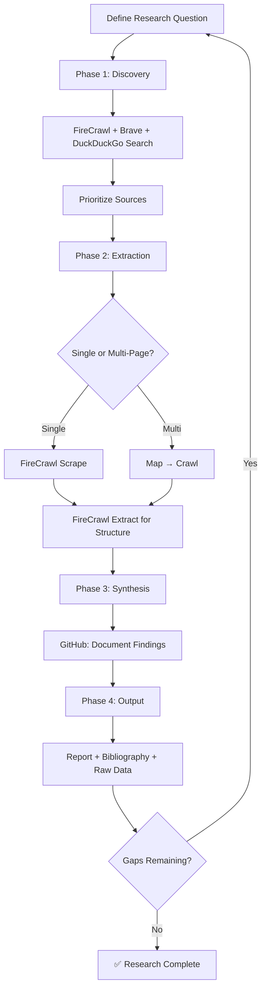

# 🔍 Deep Research MCP Framework

> **Optimal tool usage guide for comprehensive research workflows using connected MCP (Model Context Protocol) tools**

[](LICENSE)
[](RESEARCH_WORKFLOW.md)

## 🎯 What This Is

A practical framework for conducting deep, systematic research using AI-powered web search, scraping, and extraction tools. Designed for researchers, analysts, and anyone who needs to gather, synthesize, and document information from the web efficiently.

## ✨ Key Features

- **🔍 Multi-Engine Search Strategy**: Leverage FireCrawl, Brave, and DuckDuckGo for comprehensive source discovery
- **🕷️ Intelligent Scraping**: Extract content from single pages or entire websites with smart defaults
- **📊 Structured Data Extraction**: Use LLM-powered extraction with JSON schemas for consistent data
- **📚 Documentation Workflow**: GitHub-integrated organization for findings, sources, and outputs
- **⚡ Performance Optimized**: Caching, deduplication, and token management best practices
- **🔄 Iterative Process**: Built-in refinement loops for deepening research over time

## 🚀 Quick Start

### 1. Read the Guides
```bash
# For comprehensive methodology:
📖 RESEARCH_WORKFLOW.md

# For copy-paste templates & quick execution:
⚡ QUICK_START.md
```

### 2. Start a New Research Project
```bash
# Copy the template:
cp -r project-template my-research-project

# Or use GitHub's "Use this template" button
```

### 3. Run Your First Search
```json
{
  "query": "your focused research question",
  "limit": 10,
  "sources": ["web"],
  "scrapeOptions": {
    "formats": ["markdown"],
    "onlyMainContent": true
  }
}
```

## 📁 Repository Structure

```
deep-research-mcp-framework/
├── README.md                    # You are here
├── RESEARCH_WORKFLOW.md        # Complete methodology & tool guide
├── QUICK_START.md              # Templates, troubleshooting, quick reference
├── project-template/           # Ready-to-use project structure
│   ├── README.md              # Project-specific documentation
│   ├── sources/
│   │   ├── raw/               # Original scraped content
│   │   └── processed/         # Cleaned/structured data
│   ├── analysis/
│   │   └── findings.md        # Synthesized insights
│   └── outputs/
│       └── report.md          # Final deliverable
└── .github/
    └── ISSUE_TEMPLATE/        # Pre-built templates for tracking
        ├── research-question.md
        └── finding.md
```

## 🛠️ Available MCP Tools

### Search & Discovery
| Tool | Best For | Key Parameters |
|------|----------|---------------|
| `fire-crawl-firecrawl_search` | Primary source discovery | `query`, `sources`, `scrapeOptions` |
| `brave-search-brave_web_search` | Fresh news & diverse sources | `query`, `count`, `offset` |
| `duckduckgo-search-duckduckgo_web_search` | Privacy-focused broad search | `query`, `safeSearch`, `count` |

### Content Extraction
| Tool | Best For | Key Parameters |
|------|----------|---------------|
| `fire-crawl-firecrawl_scrape` | Single-page content | `url`, `formats`, `onlyMainContent` |
| `fire-crawl-firecrawl_map` | URL discovery on sites | `url`, `sitemap`, `limit` |
| `fire-crawl-firecrawl_crawl` | Multi-page site extraction | `url`, `maxDiscoveryDepth`, `limit` |
| `fire-crawl-firecrawl_extract` | Structured data extraction | `urls`, `prompt`, `schema` |

### Organization
| Tool | Best For |
|------|----------|
| GitHub Issues | Track research questions & findings |
| GitHub PRs | Collaborate on synthesis & reports |
| GitHub Files | Version control for research outputs |

## 🎓 Recommended Workflow



**Time Allocation Guide**:
- Phase 1 (Discovery): 15-20%
- Phase 2 (Extraction): 40-50%
- Phase 3 (Synthesis): 25-30%
- Phase 4 (Output): 10-15%

## 💡 Pro Tips

### Search Optimization
```bash
# Use operators for precision:
"exact phrase"          # Match exact text
site:.edu OR site:.gov  # Authoritative sources only
intitle:keyword         # Find pages with keyword in title
-exclude                # Remove unwanted terms
2023..2026              # Date range filtering
```

### Performance Boosters
```json
// Always enable these for faster, cleaner results:
{
  "onlyMainContent": true,      // Skip nav/ads/footers
  "maxAge": 172800000,          // 2-day cache (500% faster repeats)
  "deduplicateSimilarURLs": true, // Avoid redundant content
  "removeBase64Images": true    // Reduce payload size
}
```

### Token Management
- Start crawls with `limit: 10`, `maxDiscoveryDepth: 2`
- Use `fire-crawl-firecrawl_map` before crawling to estimate scope
- Break large sites into section-specific crawl jobs
- Monitor status with `fire-crawl-firecrawl_check_crawl_status`

## 🐛 Troubleshooting

| Issue | Solution |
|-------|----------|
| Irrelevant search results | Add specific keywords, use `"exact phrase"`, filter with `site:` |
| Empty scrape results | Check if page requires JS, add `waitFor: 3000`, verify URL |
| Crawl timeouts | Reduce `limit`, lower `maxDiscoveryDepth`, enable caching |
| Schema mismatch in extract | Simplify schema, test on 1 URL first, refine prompt |
| Token limit exceeded | Chunk crawls, reduce batch size, use map+batch approach |

See [QUICK_START.md](QUICK_START.md) for detailed troubleshooting guide.

## 📊 Example: Research Session

**Question**: "What are the main criticisms of current LLM evaluation benchmarks?"

```bash
# 1. Discover sources
FireCrawl Search: "LLM evaluation benchmark criticism limitations 2024"

# 2. Extract content
FireCrawl Scrape: https://arxiv.org/abs/2401.xxxxx

# 3. Structure data
FireCrawl Extract with schema: {benchmark_name, criticism_type, alternative, evidence}

# 4. Document
GitHub Issue: "Criticism: Benchmark X lacks real-world task coverage"

# 5. Iterate
Refine query: "alternative LLM evaluation methods 2024"
```

**Result**: Structured comparison of 3 benchmark criticisms in ~45 minutes

## 🤝 Contributing

1. Fork the repository
2. Create a feature branch: `git checkout -b feat/new-workflow`
3. Make your changes
4. Add documentation for new patterns
5. Submit a pull request

## 📄 License

MIT License - see [LICENSE](LICENSE) for details

## 🔗 Resources

- [Full Workflow Guide](RESEARCH_WORKFLOW.md)
- [Quick Start Templates](QUICK_START.md)
- [Project Template](project-template/)
- [GitHub Issues](https://github.com/LNDCAI001/deep-research-mcp-framework/issues)

---

**Built for researchers who need depth, speed, and organization.**

*Last Updated: April 2026 | Framework v1.0*
