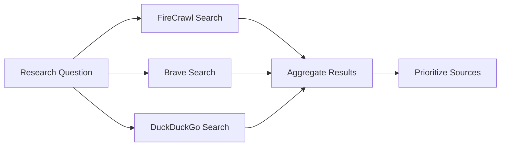
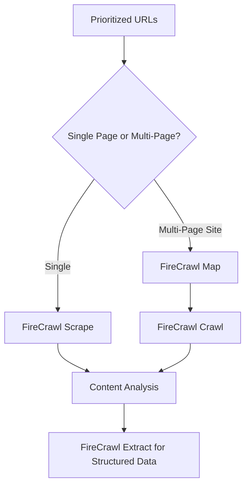

# Deep Research MCP Framework: Optimal Tool Usage Guide

## Overview
This document outlines the best order and methodology for using connected MCP (Model Context Protocol) tools for comprehensive deep research projects.

## Available MCP Tools Inventory

### 🔍 Search & Discovery Tools
| Tool | Best Use Case | Strengths | Limitations |
|------|--------------|-----------|-------------|
| `fire-crawl-firecrawl_search` | Primary research discovery | Most powerful search, supports operators, can extract content, multiple sources (web/images/news) | May timeout on complex queries |
| `brave-search-brave_web_search` | General web search with freshness controls | Good pagination, content filtering, diverse sources | Max 20 results per request |
| `duckduckgo-search-duckduckgo_web_search` | Privacy-focused, diverse source gathering | SafeSearch options, region-specific, broad coverage | Less advanced operators than FireCrawl |

### 🕷️ Web Scraping & Content Extraction
| Tool | Best Use Case | Strengths | Limitations |
|------|--------------|-----------|-------------|
| `fire-crawl-firecrawl_scrape` | Single-page content extraction | Fast, reliable, advanced options (formats, parsers, caching) | Single page only |
| `fire-crawl-firecrawl_map` | URL discovery on websites | Finds all indexed URLs, sitemap support | Doesn't fetch content |
| `fire-crawl-firecrawl_crawl` | Multi-page comprehensive extraction | Full site coverage, depth control, deduplication | Can be slow, token-heavy |
| `fire-crawl-firecrawl_extract` | Structured data extraction | LLM-powered extraction, JSON schema support, web search integration | Requires clear schema/prompt |
| `fire-crawl-firecrawl_check_crawl_status` | Monitor long-running crawls | Track progress, get results when ready | Requires prior crawl job ID |

### 💾 Documentation & Organization
| Tool | Best Use Case | Strengths |
|------|--------------|-----------|
| GitHub Tools Suite | Research output management | Version control, collaboration, issue tracking, PR workflows |

---

## 🎯 Recommended Research Workflow

### Phase 1: Broad Discovery (15-20% of time)
**Goal**: Identify relevant sources, key websites, and research landscape



**Execution Steps**:
1. **Start with FireCrawl Search** (most powerful):
   ```json
   {
     "query": "your research topic + key terms",
     "limit": 10,
     "sources": ["web", "news"],
     "scrapeOptions": {
       "formats": ["markdown"],
       "onlyMainContent": true
     }
   }
   ```

2. **Supplement with Brave Search** for freshness:
   ```json
   {
     "query": "your research topic recent developments",
     "count": 10,
     "offset": 0
   }
   ```

3. **Cross-reference with DuckDuckGo** for diverse perspectives:
   ```json
   {
     "query": "your research topic alternative viewpoints",
     "count": 10,
     "safeSearch": "moderate"
   }
   ```

4. **Deduplicate and categorize** results by:
   - Source authority (.edu, .gov, peer-reviewed)
   - Recency (last 6-12 months for fast-moving topics)
   - Relevance score (keyword match + semantic relevance)

### Phase 2: Source Deep-Dive (40-50% of time)
**Goal**: Extract comprehensive content from prioritized sources



**Execution Strategy**:

#### For Individual Pages:
```json
{
  "url": "https://example.com/key-article",
  "formats": ["markdown"],
  "onlyMainContent": true,
  "maxAge": 172800000,
  "parsers": ["llm-extract"]
}
```

#### For Website Exploration:
1. **Map first** to discover structure:
   ```json
   {
     "url": "https://example.com",
     "sitemap": "include",
     "limit": 50
   }
   ```

2. **Crawl strategically** (avoid token overflow):
   ```json
   {
     "url": "https://example.com/research/*",
     "maxDiscoveryDepth": 3,
     "limit": 20,
     "deduplicateSimilarURLs": true,
     "scrapeOptions": {
       "formats": ["markdown"],
       "onlyMainContent": true
     }
   }
   ```

3. **Monitor progress**:
   ```json
   {
     "id": "crawl-job-id-from-previous-step"
   }
   ```

#### For Structured Data Extraction:
```json
{
  "urls": ["url1", "url2", "url3"],
  "prompt": "Extract: publication date, author, key findings, methodology, limitations",
  "schema": {
    "type": "object",
    "properties": {
      "publication_date": {"type": "string"},
      "author": {"type": "string"},
      "key_findings": {"type": "array", "items": {"type": "string"}},
      "methodology": {"type": "string"},
      "limitations": {"type": "array", "items": {"type": "string"}}
    },
    "required": ["publication_date", "key_findings"]
  },
  "enableWebSearch": true
}
```

### Phase 3: Synthesis & Analysis (25-30% of time)
**Goal**: Connect findings, identify patterns, resolve contradictions

**Best Practices**:
1. **Create comparison matrices** using extracted structured data
2. **Track source credibility** with metadata (domain authority, citation count, peer-review status)
3. **Flag contradictions** for deeper investigation
4. **Use GitHub Issues** to track research questions:
   ```json
   {
     "title": "Contradiction: Study A vs Study B on [topic]",
     "body": "Study A claims X, Study B claims Y. Need to investigate methodology differences.",
     "labels": ["contradiction", "needs-review"]
   }
   ```

### Phase 4: Documentation & Output (10-15% of time)
**Goal**: Organize findings for consumption and future reference

**GitHub Integration Strategy**:
```
deep-research-mcp-framework/
├── README.md                 # Project overview
├── RESEARCH_WORKFLOW.md     # This document
├── sources/
│   ├── raw/                 # Original scraped content
│   ├── processed/           # Cleaned/structured data
│   └── metadata.json        # Source tracking
├── analysis/
│   ├── findings.md          # Synthesized insights
│   ├── contradictions.md    # Unresolved questions
│   └── visualizations/      # Charts, graphs
├── outputs/
│   ├── report.md            # Final deliverable
│   ├── bibliography.md      # Citations
│   └── appendices/          # Supporting materials
└── .github/
    ├── ISSUE_TEMPLATE/      # Research question templates
    └── workflows/           # Automation scripts
```

**Commit Strategy**:
- Use descriptive commit messages: `feat: extract findings from 5 peer-reviewed studies on [topic]`
- Tag releases for major milestones: `v1.0-initial-research-complete`
- Use branches for parallel research threads: `research/branch-A`, `research/branch-B`

---

## ⚡ Performance Optimization Tips

### Search Optimization
1. **Use search operators** with FireCrawl:
   - `"exact phrase"` for precise matching
   - `site:.edu` for academic sources
   - `intitle:keyword` for title-focused results
   - `-exclude` to filter noise

2. **Batch similar queries** to reduce API calls:
   ```
   Instead of:
   - "AI ethics 2024"
   - "AI ethics recent studies"
   - "AI ethics peer reviewed"
   
   Use:
   - "AI ethics 2024 peer reviewed site:.edu OR site:.gov"
   ```

### Scraping Optimization
1. **Enable caching** with `maxAge` parameter (500% faster for repeated requests)
2. **Use `onlyMainContent: true`** to skip navigation, ads, footers
3. **Set reasonable limits**: Start with `limit: 10` for crawls, increase if needed
4. **Avoid wildcards**: Use specific paths instead of `/*`

### Token Management
1. **Crawl depth control**: Start with `maxDiscoveryDepth: 2-3`
2. **Deduplication**: Always enable `deduplicateSimilarURLs: true`
3. **Chunk large crawls**: Break into multiple jobs by section
4. **Monitor usage**: Check crawl status before starting new jobs

### Error Handling
1. **Implement retry logic** for transient failures
2. **Log failed URLs** for manual review
3. **Set timeouts** appropriately (30-60s for scrape, longer for crawl)
4. **Validate extracted data** against schema before proceeding

---

## 🔄 Tool Selection Decision Tree

```
Start Research Question
        │
        ▼
Need broad source discovery?
├─ YES → FireCrawl Search (primary) + Brave/DuckDuckGo (supplement)
└─ NO → Skip to Phase 2

        │
        ▼
Working with known URLs?
├─ Single URL → FireCrawl Scrape
├─ Multiple pages, same domain → FireCrawl Map → FireCrawl Crawl
└─ Need structured data → FireCrawl Extract

        │
        ▼
Need to track/manage research?
├─ YES → GitHub: Create repo, use Issues for questions, PRs for outputs
└─ NO → Proceed to synthesis

        │
        ▼
Output format needed?
├─ Raw content → Markdown format in scrape/crawl
├─ Structured data → JSON schema with FireCrawl Extract
└─ Collaborative doc → GitHub + Markdown
```

---

## 📋 Quick Reference: Tool Parameters Cheat Sheet

### FireCrawl Search (Most Versatile)
```json
{
  "query": "your query here",
  "limit": 5-10,
  "sources": ["web"], // or ["web", "news", "images"]
  "scrapeOptions": {
    "formats": ["markdown"],
    "onlyMainContent": true
  }
}
```

### FireCrawl Scrape (Single Page)
```json
{
  "url": "https://...",
  "formats": ["markdown"],
  "onlyMainContent": true,
  "maxAge": 172800000,
  "removeBase64Images": true
}
```

### FireCrawl Crawl (Multi-Page)
```json
{
  "url": "https://domain.com/path/*",
  "maxDiscoveryDepth": 3,
  "limit": 20,
  "deduplicateSimilarURLs": true,
  "scrapeOptions": {
    "formats": ["markdown"],
    "onlyMainContent": true
  }
}
```

### FireCrawl Extract (Structured Data)
```json
{
  "urls": ["url1", "url2"],
  "prompt": "Extract specific fields...",
  "schema": { /* JSON Schema */ },
  "enableWebSearch": false
}
```

---

## 🚨 Common Pitfalls & Solutions

| Pitfall | Solution |
|---------|----------|
| **Token overflow on large crawls** | Reduce `limit`, lower `maxDiscoveryDepth`, use map+batch_scrape instead |
| **Missing relevant sources** | Use multiple search engines, vary query terms, use search operators |
| **Extracted data doesn't match schema** | Refine prompt, simplify schema, test on single URL first |
| **Slow performance** | Enable `maxAge` caching, reduce concurrent requests, use `onlyMainContent` |
| **Duplicate content** | Enable `deduplicateSimilarURLs`, implement post-crawl deduplication |
| **Outdated information** | Use Brave Search with freshness filters, check `maxAge` on scrapes |
| **Unclear research scope** | Create GitHub Issues for each research question before starting |

---

## 🎓 Example: Research Project Template

**Project**: "Impact of Remote Work on Productivity (2020-2024)"

1. **Phase 1 - Discovery**:
   ```
   FireCrawl Search: "remote work productivity study 2020..2024 site:.edu OR site:.gov"
   Brave Search: "remote work productivity meta-analysis recent"
   DuckDuckGo: "remote work productivity criticism limitations"
   ```

2. **Phase 2 - Extraction**:
   ```
   For each prioritized URL:
   - FireCrawl Scrape with markdown format
   - FireCrawl Extract with schema: {study_design, sample_size, key_metrics, conclusions}
   ```

3. **Phase 3 - Synthesis**:
   ```
   - Create comparison table in GitHub Markdown
   - Flag methodological differences as Issues
   - Track citation networks
   ```

4. **Phase 4 - Output**:
   ```
   - Final report in /outputs/report.md
   - Bibliography with source metadata
   - Raw data in /sources/processed/
   ```

---

## 🔄 Iteration & Refinement

Deep research is iterative. After completing a cycle:

1. **Review gaps**: What questions remain unanswered?
2. **Refine queries**: Use insights to craft more targeted searches
3. **Expand scope**: Follow citation trails, explore related topics
4. **Update documentation**: Keep GitHub repo current with new findings
5. **Archive completed work**: Tag releases, create summary issues

---

*Last Updated: April 2026*
*Framework Version: 1.0*
*Repository: github.com/LNDCAI001/deep-research-mcp-framework*
